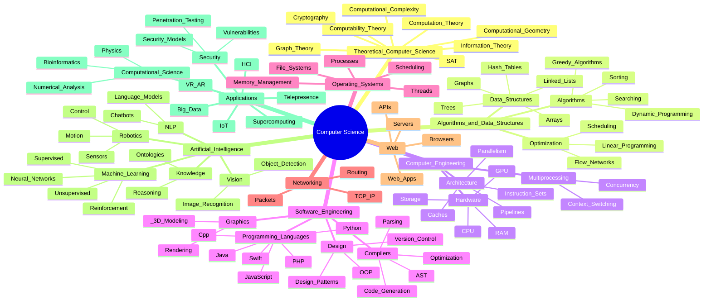

# Map of Computer Science — Outline
*A conceptual, bird’s-eye overview (based on the visual map by Dominic Walliman).*

## 1. Theoretical Computer Science

### 1.1 Computability Theory
- **Turing Machine** — Mathematical model that defines what is computable.  
- **State register, tape, head** — Components of basic computation.  
- **Alan Turing** — Founder of computation theory.  
- **Lambda Calculus** — Foundation of functional programming and computability.

### 1.2 Computation Theory
- **Decidability** — Which problems can be solved by algorithms.  
- **Undecidability** — Problems no algorithm can solve.  
- **Automata Theory** — Finite automata, pushdown automata, Turing machines.  
- **Formal Languages** — Regular, context-free, context-sensitive languages.

### 1.3 Computational Complexity
- **P vs NP** — Major open problem in CS.  
- **NP-complete problems** — Hardest problems in NP.  
- **Big-O notation** — Measures time/space growth.  
- **Efficient algorithms** — Polynomial-time solutions.

### 1.4 Information Theory
- **Entropy** — Quantifies information content.  
- **Compression** — Representing data in fewer bits.  
- **Error correction** — Detecting and fixing corrupted bits.  
- **Coding theory** — Designing robust encoding schemes.

### 1.5 Cryptography
- **Public-key cryptography** — Two-key secure communication.  
- **Private-key cryptography** — Shared secret encryption.  
- **Hashing** — One-way, collision-resistant functions.  
- **Protocols** — Secure exchanges (TLS, signatures).

### 1.6 Graph Theory
- **Nodes and edges** — Represent relationships.  
- **Paths, cycles, trees, DAGs** — Fundamental structures.  
- **Graph algorithms** — Shortest path, spanning tree, connectivity.

### 1.7 Computational Geometry
- **Distances, intersections, shapes**  
- **Convex hulls**  
- **Spatial data structures**  
Applications in graphics, robotics, GIS.

### 1.8 Boolean Satisfiability (SAT)
- **SAT problems** — Determine if a logical formula can be satisfied.  
Foundational in verification, optimization, reasoning.

---

## 2. Algorithms & Data Structures

### 2.1 Algorithms
- **Sorting** — Bubble, Merge, Quick, etc.  
- **Searching** — Binary search, BFS/DFS.  
- **Dynamic programming** — Breaking problems into subproblems.  
- **Greedy algorithms** — Best local choice strategy.  
- **Graph algorithms** — Dijkstra, A*, spanning trees.

### 2.2 Data Structures
- **Arrays, linked lists, stacks, queues**  
- **Trees, heaps**  
- **Graphs**  
- **Hash tables**  
Efficient organization and access to data.

### 2.3 Optimization
- **Linear programming**  
- **Flow networks**  
- **Scheduling**  
Used in logistics, planning, operations research.

---

## 3. Computer Engineering

### 3.1 Hardware
- **CPU** — Executes instructions.  
- **GPU** — Parallel computing for graphics/ML.  
- **RAM** — Short-term memory.  
- **Storage** — HDD/SSD.  
- **Motherboards & buses** — Connect hardware.

### 3.2 Computer Architecture
- **Instruction sets (ISA)**  
- **Pipelines**  
- **Caches**  
- **Parallel architectures** — Multicore systems.  
- **FPGA** — Reconfigurable hardware logic.

### 3.3 Scheduling & Multiprocessing
- **Schedulers** — Choose running processes.  
- **Context switching**  
- **Concurrency & parallelism**

---

## 4. Software Engineering

### 4.1 Programming Languages
Common examples shown:
- Python  
- Java  
- C / C++  
- JavaScript  
- Swift  
- PHP  
- SQL  
- Perl, Ruby

### 4.2 Compilers & Interpreters
- **Lexing / parsing**  
- **AST generation**  
- **Optimization**  
- **Code generation**  
- **Virtual machines** — JVM, CLR.

### 4.3 Object-Oriented Design
- **Classes, objects, interfaces**  
- **UML, design patterns**  
- **Version control** — Git.

### 4.4 Computer Graphics
- **Rendering**  
- **Lighting, shading, texture mapping**  
- **3D modeling**

---

## 5. Operating Systems

- **Processes and threads**  
- **Scheduling**  
- **Memory management**  
- **File systems**  
Examples pictured: iOS, macOS.

---

## 6. Networking & Web

### 6.1 Networking
- **Packets & routing**  
- **TCP/IP stack**  
- **Switches, routers**

### 6.2 Data Management
- **Databases & datacenters**  
- **Query processing & indexing**  
- **Performance & scaling**

### 6.3 The Web
- **Browsers**  
- **Servers & APIs**  
- **Web applications**

---

## 7. Artificial Intelligence

### 7.1 Machine Learning
- **Supervised learning**  
- **Unsupervised learning**  
- **Reinforcement learning**  
- **Neural networks**

### 7.2 Computer Vision
- **Image detection & segmentation**  
- **Object recognition**

### 7.3 Natural Language Processing
- **Chatbots**  
- **Language models**  
- **Text processing**

### 7.4 Knowledge Representation
- **Ontologies**  
- **Logical reasoning**  
- **Symbolic AI**

### 7.5 Robotics
- **Control systems**  
- **Sensors**  
- **Kinematics**

---

## 8. Applications

### 8.1 Supercomputing
- **Massively parallel computation**  
- **High-performance clusters**

### 8.2 Virtual & Augmented Reality
- **Simulation**  
- **3D environments**

### 8.3 Telepresence
- **Remote embodiment & communication**

### 8.4 Human-Computer Interaction
- **UI/UX**  
- **Interaction models**

### 8.5 Internet of Things
- **Connected devices & sensors**

### 8.6 Big Data
- **Massive datasets**  
- **Distributed analytics**

### 8.7 Computational Science
- **Computational physics**  
- **Numerical analysis**  
- **Bioinformatics**  
- **Computational chemistry**

### 8.8 Hacking & Security
- **Penetration testing**  
- **Security models**  
- **Vulnerabilities**

